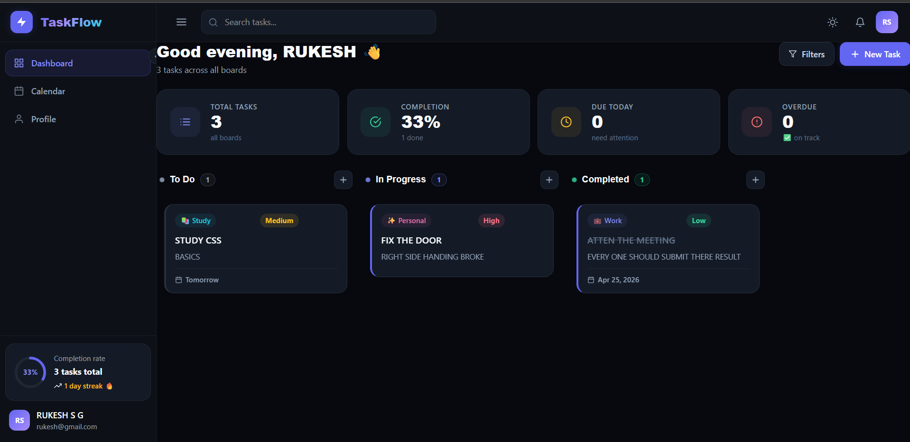
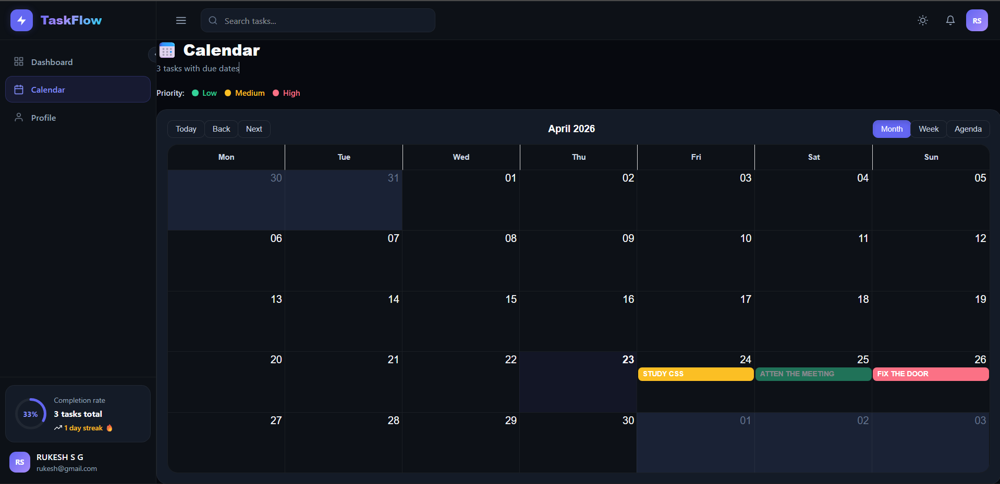
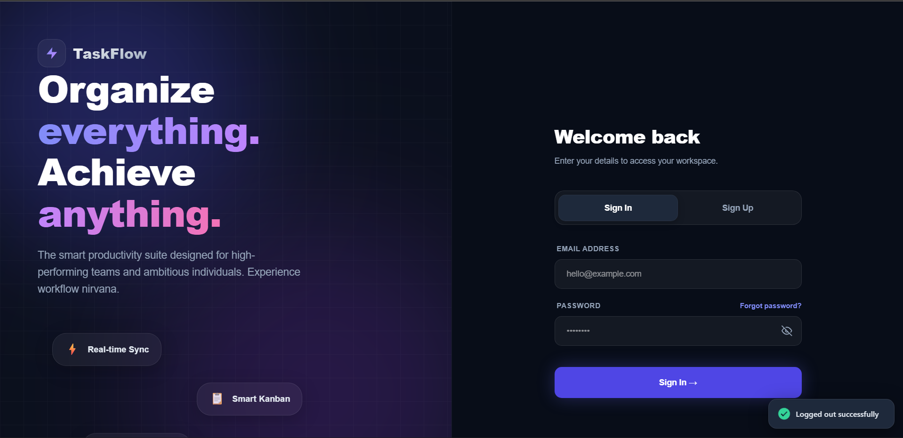

# TaskFlow: Smart Productivity Manager


TaskFlow is an ultra-premium, full-stack Task Management application designed for high-performing individuals and teams. Built with the MERN stack (MongoDB, Express, React, Node.js), it features a highly responsive, glassmorphism-inspired UI, real-time synchronization, interactive Kanban boards, and a comprehensive Calendar view.

## 🌐Live Demo
- 🔗 Frontend: https://task-flow-smart-productivity-task-manager-nqrokvypt.vercel.app
- 🔗 Backend API: https://taskflow-smart-productivity-task-manager.onrender.com

## ✨ Features

- **Authentication System**: Secure JWT-based login/registration with encrypted passwords.
- **Dynamic Kanban Board**: Drag-and-drop task management grouped by status.
- **Smart Calendar**: Monthly, weekly, and agenda views colored dynamically by task priority.
- **Dark/Light Mode**: Full CSS-variable-based theming engine with seamless toggling.
- **Real-Time Readiness**: Architecture pre-configured for Socket.io synchronization.
- **Advanced Filtering & Analytics**: Real-time stats calculation and streak tracking.

## 📸 Screenshots

### 🏠 Home Page / Kanban Board
<p align="center">
  
</p>

### 📅 Smart Calendar
<p align="center">
  
</p>

### 🔐 Login Page
<p align="center">
  
</p>

## 🚀 Tech Stack

**Frontend:**
- React 19 (Vite)
- Framer Motion (Animations)
- React Big Calendar
- Axios (API Client)
- Vanilla CSS Variables (No external UI frameworks)

**Backend:**
- Node.js & Express.js
- MongoDB & Mongoose
- JSON Web Tokens (JWT) & bcryptjs
- Helmet & Express Rate Limit (Security)

## 📦 Local Development

### Prerequisites
- Node.js (v18+)
- MongoDB Atlas cluster URL (or local MongoDB)

### Installation

1. **Clone the repository**
   ```bash
   git clone https://github.com/yourusername/taskflow.git
   cd taskflow
   ```

2. **Install Dependencies**
   Run the setup script from the root directory to install both frontend and backend dependencies:
   ```bash
   npm install
   cd frontend && npm install
   cd ../backend && npm install
   ```

3. **Environment Variables**
   Create a `.env` file in the `backend/` directory with the following variables:
   ```env
   PORT=5000
   MONGO_URI=mongodb://your_replica_set_string_here
   JWT_SECRET=your_super_secret_key
   JWT_EXPIRE=30d
   NODE_ENV=development
   CLIENT_URL=http://localhost:5173
   ```

4. **Start the Application**
   From the root folder, run the dev servers concurrently:
   ```bash
   npm run dev:backend
   # In a separate terminal:
   npm run dev:frontend
   ```

## 🌐 Deployment Configuration

The repository is structured for seamless deployment using a monorepo setup:
- **Backend (Render)**: The `backend/` folder contains a robust Express server. Ensure environment variables are added in your hosting dashboard.
- **Frontend (Vercel)**: The `frontend/` folder uses Vite. The build command is `npm run build` and the publish directory is `dist`. A `vercel.json` file is included for SPA routing rules.

## 📄 License

This project is licensed under the Apache License 2.0.
